# Expresiones regulares y autómatas finitos determinísticos para el lenguaje TINY

La lista de tokens utilizados por el lexer, junto con sus respectivos lexemas válidos, es la siguiente.

- `(PROGRAM, "program")`
- `(VAR, "var")`
- `(INT, "int")`
- `(BOOL, "bool")`
- `(TRUE, "true")`
- `(FALSE, "false")`
- `(BEGIN, "begin")`
- `(END, "end")`
- `(IF, "if")`
- `(ELSE, "else")`
- `(NOT, "not")`
- `(GOTO, "goto")`
- `(LET, "let")`
- `(AND, "and")`
- `(OR, "or")`
- `(DOT, ".")`
- `(SEMICOLON, ";")`
- `(COLON, ":")`
- `(ELLIPSIS, "...")`
- `(ASSIGN, "=")`
- `(LPAREN, "(")`
- `(RPAREN, ")")`
- `(PLUS, "+")`
- `(MINUS, "-")`
- `(ASTERISK, "*")`
- `(EQUAL, "==")`
- `(NOT_EQUAL, "<>")`
- `(LESS_THAN, "<")`
- `(GREATER_THAN, ">")`
- `(LESS_EQUAL, "<=")`
- `(GREATER_EQUAL, ">=")`
- `(ID, id)` (A-Z, a-z y 0-9, pero no puede comenzar con un número)
- `(NUMBER, num)` (solo se considera el conjunto $\mathbb{Z}$)
- `(WHITESPACE, " " | "\t" | "\n")`

> [!warning]
> El token `WHITESPACE` se utiliza internamente por cuestiones de legibilidad del código fuente y facilidad de desarrollo (del lexer). No forma parte de la gramática, ni de la salida del lexer.

A continuación, se encuentran detallados cada uno de ellos, incluyendo su expresión regular y autómata finito determinístico (AFD) correspondiente.

> [!note]
> Se utiliza $\beta$ como cadena en blanco, y $\lambda$ como cadena vacía.

## PROGRAM

```math
\text{"program"}
```

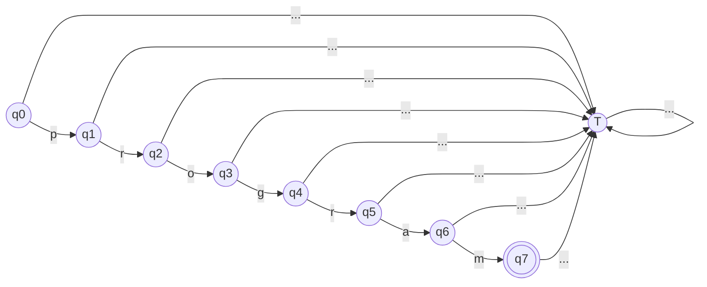

## VAR

```math
\text{"var"}
```

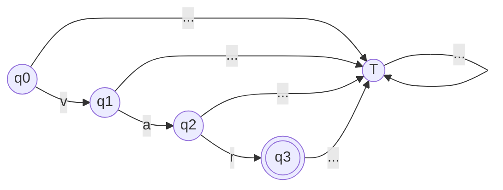

## INT

```math
\text{"int"}
```

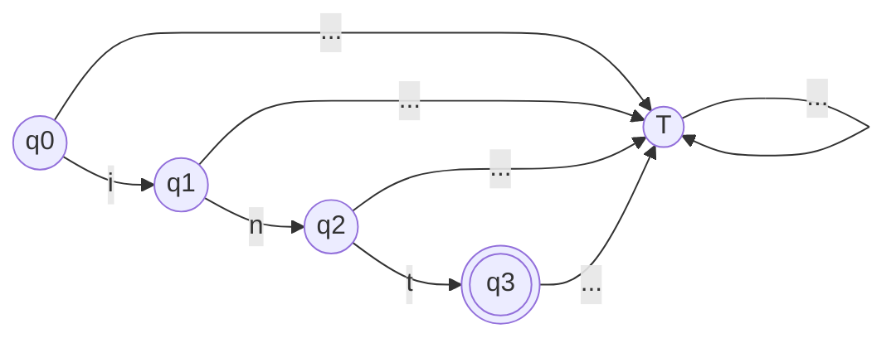

## BOOL

```math
\text{"bool"}
```

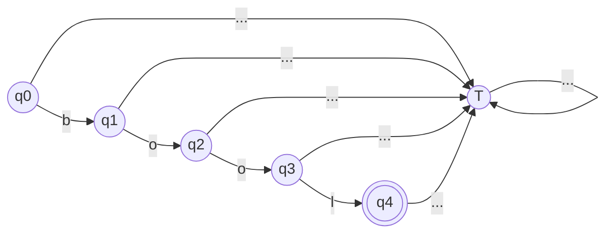

## TRUE

```math
\text{"true"}
```


## FALSE

```math
\text{"false"}
```

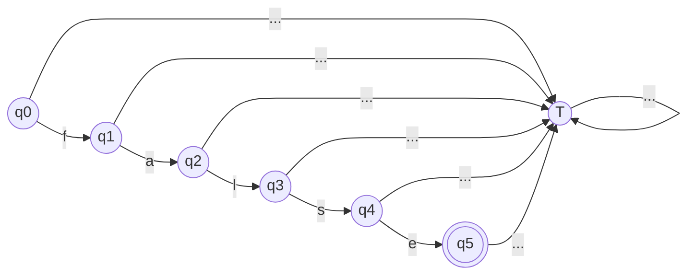

## BEGIN

```math
\text{"begin"}
```

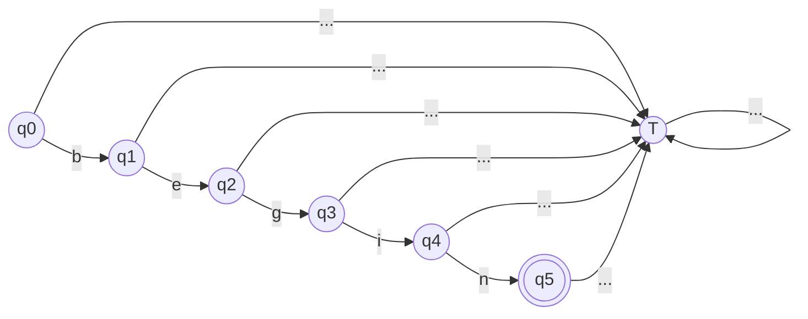

## END

```math
\text{"end"}
```


## IF

```math
\text{"if"}
```

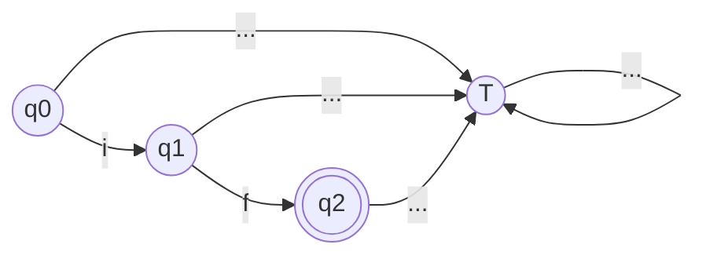

## ELSE

```math
\text{"else"}
```


## NOT

```math
\text{"not"}
```


## GOTO

```math
\text{"goto"}
```

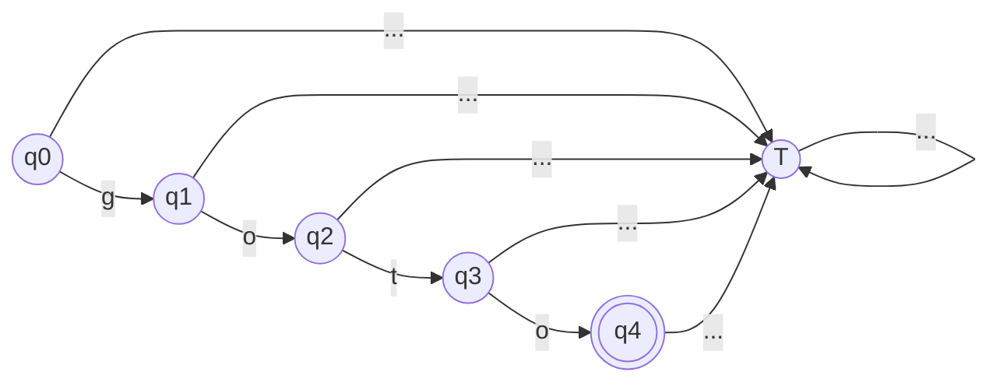

## LET

```math
\text{"let"}
```

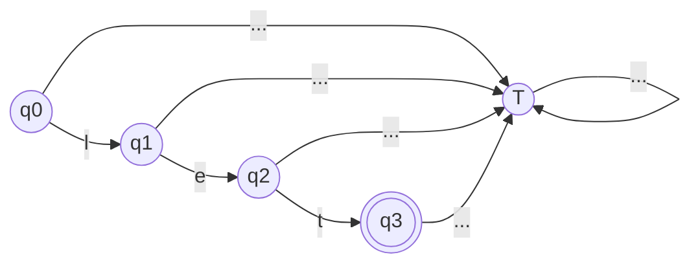

## AND

```math
\text{"and"}
```

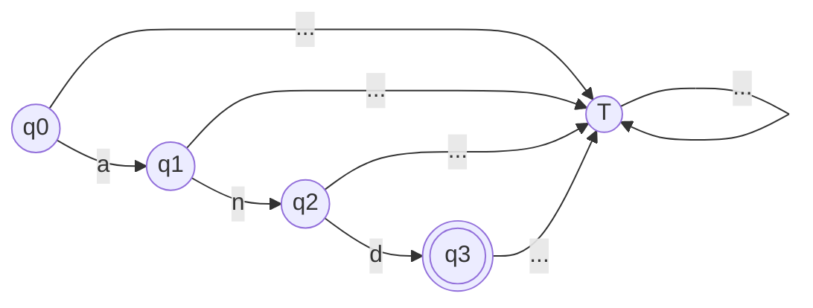

## OR

```math
\text{"or"}
```

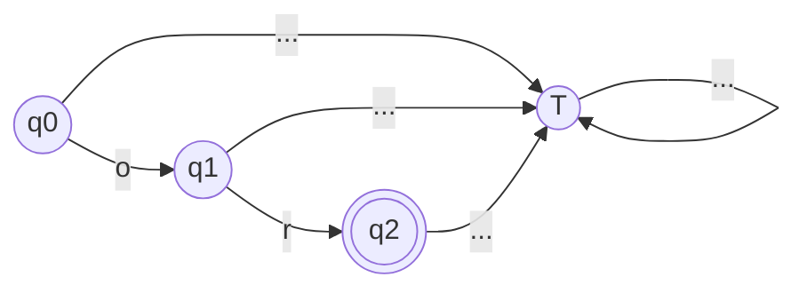

## DOT

```math
\text{"."}
```

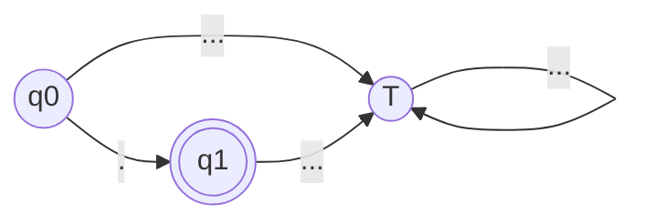

## SEMICOLON

```math
\text{";"}
```


## COLON

```math
\text{":"}
```


## ELLIPSIS

```math
\text{"} \dots \text{"}
```

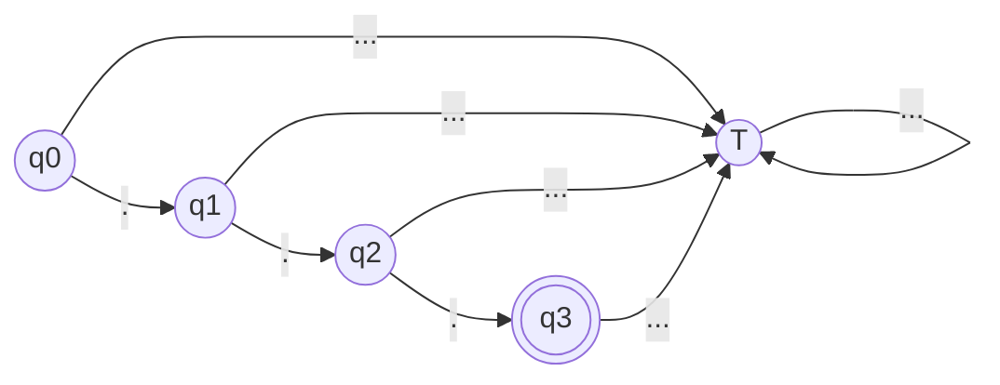

## ASSIGN

```math
\text{"="}
```

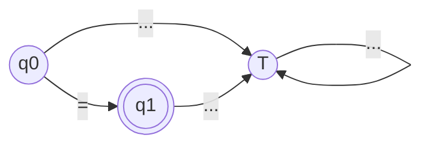

## LPAREN

```math
\text{"} \left( \right. \text{"}
```

```mermaid
flowchart LR
    q0(("q0"))
    q1((("q1")))
    T(("T"))

    q0 -- "(" --> q1
    q0 & q1 & T -- "..." --> T
```

## RPAREN

```math
\text{"} \left. \right) \text{"}
```

```mermaid
flowchart LR
    q0(("q0"))
    q1((("q1")))
    T(("T"))

    q0 -- ")" --> q1
    q0 & q1 & T -- "..." --> T
```

## PLUS

```math
\text{"+"}
```

```mermaid
flowchart LR
    q0(("q0"))
    q1((("q1")))
    T(("T"))

    q0 -- "\+" --> q1
    q0 & q1 & T -- "..." --> T
```

## MINUS

```math
\text{"-"}
```

```mermaid
flowchart LR
    q0(("q0"))
    q1((("q1")))
    T(("T"))

    q0 -- "\-" --> q1
    q0 & q1 & T -- "..." --> T
```

## ASTERISK

```math
\text{"*"}
```

```mermaid
flowchart LR
    q0(("q0"))
    q1((("q1")))
    T(("T"))

    q0 -- "\*" --> q1
    q0 & q1 & T -- "..." --> T
```

## EQUAL

```math
\text{"=="}
```

```mermaid
flowchart LR
    q0(("q0"))
    q1(("q1"))
    q2((("q2")))
    T(("T"))

    q0 -- "=" --> q1 -- "=" --> q2
    q0 & q1 & q2 & T -- "..." --> T
```

## NOT_EQUAL

```math
\text{"<>"}
```

```mermaid
flowchart LR
    q0(("q0"))
    q1(("q1"))
    q2((("q2")))
    T(("T"))

    q0 -- "\<" --> q1 -- "\>" --> q2
    q0 & q1 & q2 & T -- "..." --> T
```

## LESS_THAN

```math
\text{"<"}
```

```mermaid
flowchart LR
    q0(("q0"))
    q1((("q1")))
    T(("T"))

    q0 -- "\<" --> q1
    q0 & q1 & T -- "..." --> T
```

## GREATER_THAN

```math
\text{">"}
```

```mermaid
flowchart LR
    q0(("q0"))
    q1((("q1")))
    T(("T"))

    q0 -- "\>" --> q1
    q0 & q1 & T -- "..." --> T
```

## LESS_EQUAL

```math
\text{"<="}
```

```mermaid
flowchart LR
    q0(("q0"))
    q1(("q1"))
    q2((("q2")))
    T(("T"))

    q0 -- "\<" --> q1 -- "=" --> q2
    q0 & q1 & q2 & T -- "..." --> T
```

## GREATER_EQUAL

```math
\text{">="}
```

```mermaid
flowchart LR
    q0(("q0"))
    q1(("q1"))
    q2((("q2")))
    T(("T"))

    q0 -- "\>" --> q1 -- "=" --> q2
    q0 & q1 & q2 & T -- "..." --> T
```

## ID

```math
\left( \text{"A"} + ... + \text{"Z"} + \text{"a"} + ... + \text{"z"} \right) \left( \text{"A"} + ... + \text{"Z"} + \text{"a"} + ... + \text{"z"} + 0 + ... + 9 \right)^*
```

```mermaid
flowchart LR
    q0(("q0"))
    q1((("q1")))
    T(("T"))

    q0 -- "A-Z, a-z" --> q1
    q1 -- "A-Z, a-z, 0-9" --> q1
    q0 & q1 & T -- "..." --> T
```

## NUMBER

```math
\left( \text{"-"} + \lambda \right) \left( 0 + 1 + 2 + 3 + 4 + 5 + 6 + 7 + 8 + 9 \right)^+
```

```mermaid
flowchart LR
    q0(("q0"))
    q1(("q1"))
    q2((("q2")))
    T(("T"))

    q0 -- "\-" --> q1
    q0 & q1 & q2 -- "0-9" --> q2
    q0 & q1 & q2 & T -- "..." --> T
```

## WHITESPACE

```math
\left( \beta + \text{"\\t"} + \text{"\\n"} \right)^+
```

```mermaid
flowchart LR
    q0(("q0"))
    q1((("q1")))
    T(("T"))

    q0 & q1 -- "β, \t, \n" --> q1
    q0 & q1 & T -- "..." --> T
```
